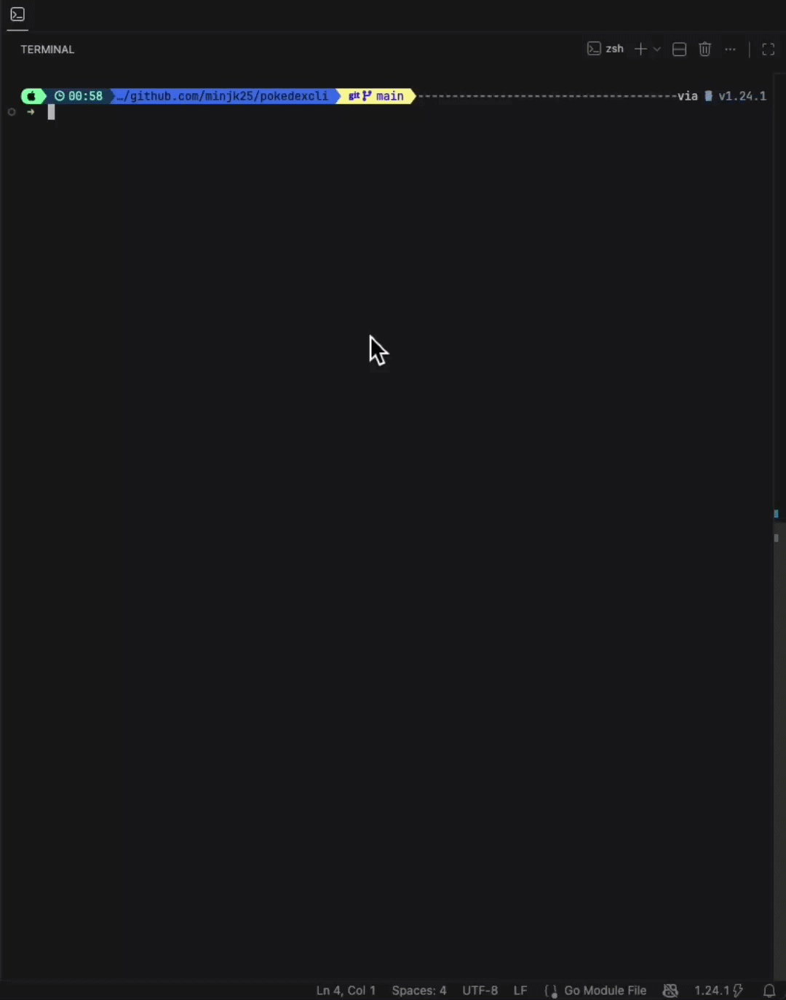

# Pokedex CLI
A command-line Pokedex built in Go. Explore Pokemon locations, catch Pokemon, and inspect your collection, all from your terminal.

## Features
- Explore Pokemon locations from the [PokeAPI](https://pokeapi.co/)
- Navigate through location pages forward and backward
- Catch Pokemon with a chance-based system
- Inspect caught Pokemon stats
- View your full Pokedex collection
- Built-in caching to reduce API calls

## What I Learned
| Feature   | What I Learned |
|-----------|---------|
| Interactive REPL |`bufio.Scanner`, input parsing, control flow |
| Location navigation | HTTP requests with `net/http`, JSON decoding |
| Built-in caching | In-memory cache, `sync.Mutex`, `time.Duration` |
| Catch system | Randomness, map storage, structs and methods |
| Inspect & Pokedex | Pointers, error handling, variadic functions |
| Debug logging | `log/slog`, structured logging, log levels |
| Unit tests | `testing` package, table-driven tests |

## Requirements
- Go 1.21+

## Installation
```bash
# 1. Clone the repository
git clone https://github.com/minjk25/pokedexcli.git
cd pokedexcli

# 2. Run the program
go build && ./pokedexcli
```

## Usage
```bash
Pokedex > <command> [arguments]
```
### Commands
| Command |	Arguments |	Description |
|-----------|---------|---------|
| help |	none |	Display available commands |
| map |	none |	Show next page of locations |
| mapb |	none |	Show previous page of locations |
| explore |	<location_name> |	List Pokemon in a location |
| catch |	<pokemon_name> |	Attempt to catch a Pokemon |
| inspect |	<pokemon_name> |	View stats of a caught Pokemon |
| pokedex |	none |	List all caught Pokemon |
| exit |	none |	Exit the program |

### Example


## Note
This project was built as a learning exercise for Go from the [Boot.dev](https://www.boot.dev) backend course. I plan to expand it with more features over time to make it more interesting. Stay tuned!
